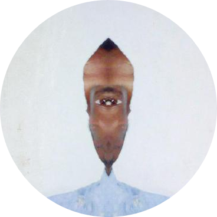

<html>
<!-- <center> -->
    <!-- <b>Kenneth</b> -->
    <!-- <br> -->
    <!-- < -->
    <!-- <a href="https://github.com/kendfss">github</a> -->
    <!-- | <a href="http://tildegit.org/eli2and40">~git</a> -->
    <!-- <a href=""></a> -->
    <!-- > -->
    <!-- <br> -->
    <!--  --> 
<!-- </center> -->
<link rel="stylesheet" type="text/css" href="prism.css">

<p>you have reached a view. </p>
<details><summary>here is a controller</summary>

<!-- ```go -->
<pre>
<code class="language-go line-numbers">self := &Noun{
    Name:  "Kenneth Sabalo",
    Quote: "There was a time when man would break back over symphonies and conciertos; now him push buttons, make houses, and technos",
    Year:  1995,
    Schools: {
        "St. John's University [BS, Physics] (2019 - Jamaica, New York)",
        "Thomas A. Edison High School [Diploma, International Baccalaureate] (2013 - Alexandria, Virginia)",
        "Claremont High School [GCSEs/BTEC] (2011 - London, England)",
    },
    Resides:  "Luanda, Angola",
    Hometown: "London, England",
    Publications: {
        "A Study of PbS Nanoparticle Synthesis from Sulfur Powder (AIMS Press) (2017)",
        "Photocurrent Enhancement by Introducing Gold Nanoparticles in Nanostructure-based Heterojunction Solar Cell Device (Materials Research Society) (2017)",
    },
}
</code>
</pre>
<!-- ``` -->
*<small>This code was written for readability <i>and should not</i> be passed to a `go` compiler.</small>
</details>

<details><summary>here are some models</summary>

<!-- ```go -->
<pre>
<code class="language-go line-numbers">type (
    Noun struct {
        Quote        string
        Year         uint11
        Schools      []string
        Resides      string
        Hometown     string
        Publications string
    }
    Verb interface{}
)
</code>
</pre>
<!-- ``` -->
<!-- <a href="">Let me explain</a> -->
\*<small>This code was written for readability <i>and should not</i> be passed to a `go` compiler.</small>
</details>

<!-- <center>
    <i>
    chasing that feeling you get when the fact that B has bugs is the only reason you know that A is working; despite, and arguably because of, the futility of it all
    </i>
</center> -->
<script src="prism.js"></script>
<center>
    
</center>
</html>
